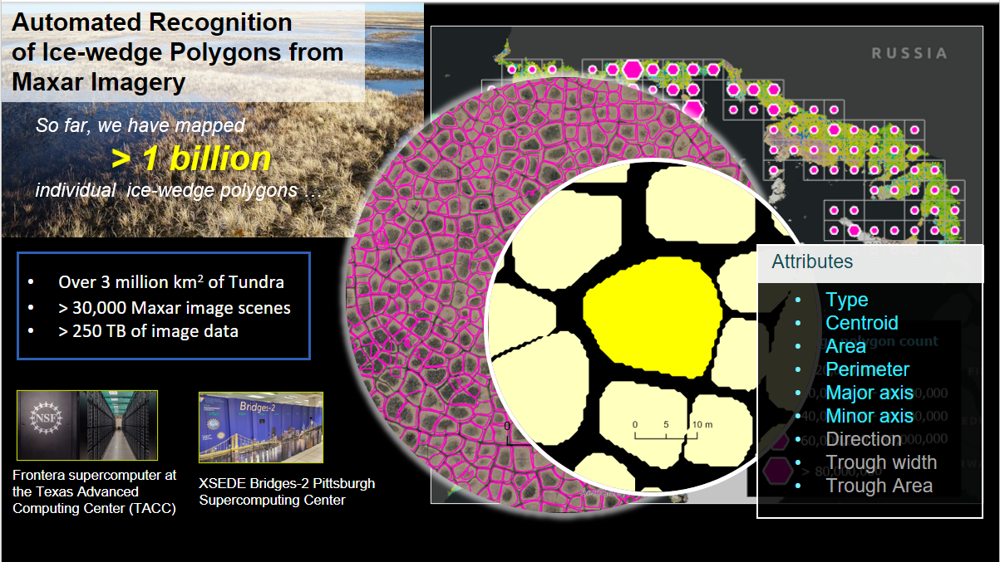

# MAPLE

## Introduction
Increasing availability of high spatial resolution remote sensing data, particularly the sub-meter imagery acquired by commercial satellite sensors, provide unprecedented opportunities to map, monitor, and document permafrost features and their change over time. High performance image analysis algorithms/workflows/pipelines centered on AI are indeed required to perform rigonal- to pan-Arctic scale mappings from big image data sets that are freely available to the NSF-funded Arctic researcher community.

Mapping Application for Arctic Permafrost Land Environment (MAPLE) serves as the main container/pipeline harboring multiple mapping workflows. The MAPLE is essentially an extensible pipeline that centers on DL and high performance computing. It allows users to interlace different deep learning convolutional neural net algorithms to conveniently analyze remote sensing imagery and geospatial data.

Mapping requires a workflow to train an AI ML model to learn how to do the mapping and another pipeline to do the mapping (inferencing). This code base is for the inferencing that will use an already trianed model to do the mapping of a large volume of avaialble un mapped images. 

In general AI-ML-DL models are transferable via [weight file](#weight-file) that is a prerequsited for this model to do the inferencing. And it should be noted that the type of training data that was used for training will have a major effect on te accuracy. This codebase was used to produce the data product at the [Permafrost Discovery Gateway](https://arcticdata.io/catalog/portals/permafrost) Considering the volume of the data big data pipeline was used on HPCs for the mapping. Care was taken ensure that the code base work on hetrogenious big data envirenments taking advantage of the underline computing architectures. The code can be also executed on a single local machine. 

# Setting up Conda Envirenment
The code is scripted using python and for execution the proper python env should be setup using conda. It is advicable to install the lates version of miniconda or varient and intall the required envionment using the yml file provided. The required packages are:

  - python=3.6
  - tensorflow-gpu==1.14.0
  - keras==2.3.1
  - numpy==1.17.4
  - gdal==2.3.2
  - pyshp==2.1.0
  - scikit-image==0.16.2
  - shapely==1.6.4

Mske sure conda is used rather than pip to install as the conda will let you know if their are conflict in the envirenment. Some of the above a pythonwrappers to libraries that may have issues in the particular envirenment you are running it. [More details](https://conda.io/projects/conda/en/latest/user-guide/tasks/manage-conda.html)

#Running MAPLE

## Preparing Data

<h2 id="weight-file"> Weight File </h2>

## Configuration
