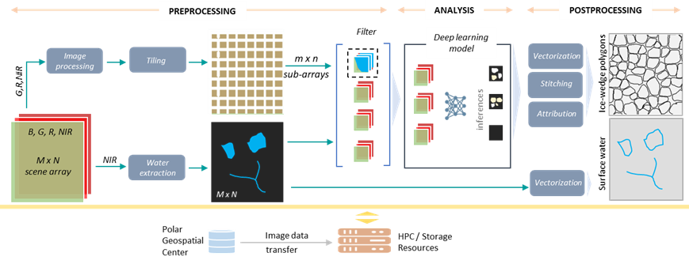

# MAPLE

## Introduction
Increasing availability of high spatial resolution remote sensing data, particularly the sub-meter imagery acquired by commercial satellite sensors, provide unprecedented opportunities to map, monitor, and document permafrost features and their change over time. High performance image analysis algorithms/workflows/pipelines centered on AI are indeed required to perform regional to pan-Arctic scale mappings from big image data sets that are freely available to the NSF-funded Arctic researcher community.

Mapping Application for Arctic Permafrost Land Environment (MAPLE) serves as the main container/pipeline harboring multiple mapping workflows. The MAPLE is essentially an extensible pipeline that centers on deep learning (DL) and high performance computing. It allows users to interlace different DL convolutional neural net algorithms to conveniently analyze remote sensing imagery and geospatial data.

Mapping requires a workflow to [train an AI ML model](https://github.com/PermafrostDiscoveryGateway/MAPLE_v3/tree/main/MAPLE_Training) to learn how to do the mapping and another pipeline to do the mapping (inferencing). This code base is for the inferencing that will use an already trained model to do the mapping of a large volume of available unmapped images. 

In general AI-ML-DL models are transferable via [weight file](#weight-file) that is a prerequsite for this model to do the inferencing. And it should be noted that the type of training data that was used for training will have a major effect on the accuracy. This codebase was used to produce the data product at the [Permafrost Discovery Gateway](https://arcticdata.io/catalog/portals/permafrost) Considering the volume of the data a big data pipeline was used on HPCs for the mapping. Care was taken ensure that the code base work on heterogenious big data environments taking advantage of the underline computing architectures. This code can be also executed on a single local machine with or without GPUs. 

The following diagram shows an overview of the maple workflow

# Setting up Conda Environment
The code is scripted using python and for execution the proper python env should be setup using conda. It is advisable to install the latest version of [miniconda](https://docs.conda.io/projects/miniconda/en/latest/#quick-command-line-install), or variant, and install the required environment using the [yml](https://github.com/PermafrostDiscoveryGateway/MAPLE_v3/blob/main/environment_maple.yml) file provided ([see instructions](https://conda.io/projects/conda/en/latest/user-guide/tasks/manage-environments.html#creating-an-environment-from-an-environment-yml-file)). The required packages are:

  - python=3.6
  - tensorflow-gpu==1.14.0
  - keras==2.3.1
  - numpy==1.17.4
  - gdal==2.3.2
  - pyshp==2.1.0
  - scikit-image==0.16.2
  - shapely==1.6.4

Make sure conda is used rather than pip to install as the conda will let you know if there are conflict in the environment. Some of the above are python wrappers to libraries that may have issues in the particular environment you are running it. [More details about conda managment can be found](https://conda.io/projects/conda/en/latest/user-guide/tasks/manage-conda.html)

# Running MAPLE

To execute maple you need to run the workflow. Depending on the location where you are runing you may need to write some code to generate a batch script to be deployed on the compute nodes some examples can be made available to get started.

## Configuration
Multiple configurations are possible based on the compute environment and also the input data to be processed.
It is required to maintain the model based configurations to ensure you get an output that is consistent to the training done. The most important configuration is to indicate the location of the weight file.

It is recomended not to edit the main config file but to have our own config file to modify the configuration based on our requirements. You can edit the maple_config.py file with all the required parameters that include the location of the data and the locations of the output files and also the locations to store the temporary files. Since most of the HPCs do not allow us to store large files on local nodes we have to use a common location for the files.

As it is wirtten you need to create a directory structure based on the config file to store the temp data. A small [pythen script](mpl_wokflow_create_dir_struct.py) is written  to generate this structure but make sure it matches the configuration. Otherwise errors will be thrown in certain cases and may not in certain cases and fail later on the pipeline.

The following directory structure and the files must be there to run

├── data  
│ ├── cln_data  
│ ├── divided_img  
│ ├── final_shp  
│ ├── input_img_local  
│ │    └── test_image_01.tif  
│ ├── output_img  
│ ├── output_shp  
│ └── water_mask  
│    └── temp  
└── hyp_best_train_weights_final.h5  

Root directory where this structure is located should also be given in the maple_configuration file. 

For HPC execution depending on your HPC you also need to indicate the .out .err locations for it to get it executed as a batch job.

## Preparing Data

Data can be in geo tagged tiff files. Have the option of running it by pointing it to a input data directory that contains the files that you want executed or you can give a list of files to be executed. There is also an option to use a collection of overlap shapefiles related a to a batch of input files that inidicates the overlaps so that the processing of overalped input images can be avoided.

As part of the data preperation
For the basic vanilla configuration you only need a list of input tiff files in a directory and for this shared code it is for one image file. [Two sample images](https://drive.google.com/drive/folders/1wr4jz6ZMa4mUYYlYfzCNv67V37OoPoZt?usp=sharing) The input files should be located input_img_local folder and the location of the data folder should be indicarted in the [mpl_config.py](https://github.com/PermafrostDiscoveryGateway/MAPLE_v3/blob/main/mpl_config.py) file. As part of post processing you can indicate some [cleaning data filters](https://drive.google.com/file/d/1s4aKpLh4IL7YFkk4pqdhnDSqg-9eMk8M/view?usp=drive_link) that would remove false positives based on known data.

<h2 id="weight-file"> Weight File </h2>

This is the [trainded weight file](https://drive.google.com/file/d/1R51e8YqTKvc_5lq7wSKEbu1G1nyV1-YZ/view?usp=drive_link) that is required for the model to do the inferencing

